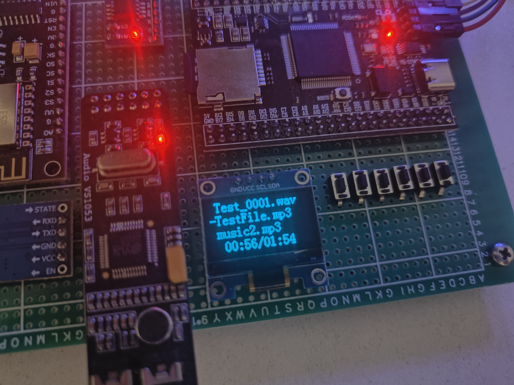

# STM32-Player：嵌入式STM32音乐播放器



## 简介

这是WHUT机电学院测控技术与仪器专业毕业设计的一部分：

> 针对儿童娱乐场景，设计基于嵌入式的数字音乐播放器。研究选择嵌入式系统平台，设计音乐播放器系统方案，搭建硬件测试平台，能够播放歌曲，具备音乐下载功能和录音功能，实现音乐目录浏览、暂停、播放、进度调节等功能。

该仓库仅供学习研究使用，不具备太多实用价值

## 主要功能

- MP3、WAV音频播放，理论上支持OGG、AAC等其它音频格式
- ADPCM录音（WAV格式）
- NodeMCU网络应用，提供OpenAI API交互能力

## 核心硬件

- STM32F103VET6
- ESP8266
- W25Q64 Flash
- VS1053b DSP
- SSD1306 0.96'' OLED

## 软件依赖

- STM32F10X HAL Library
- Cortex-M3 CMSIS
- [FreeRTOS](https://www.freertos.org/index.html)
- [Chan's FatFs](http://elm-chan.org/fsw/ff/)
- [NodeMCU](https://www.nodemcu.com/)

## 构建

本项目使用GCC 13.2工具链交叉编译，编译目标三元组为`arm-none-eabi`，**不保证其它工具链构建可行性**

使用Git克隆本仓库：

```
git clone https://github.com/SignedWhiskeyXD/STM32-Player.git
```

使用CMake构建项目：

- 通过支持CMake的IDE打开本项目（例如VSCode CLion等），并通过`CMakeLists.txt`对项目进行配置
- 或者，你可以通过以下命令构建：

```
mkdir build
cd build
cmake -G "Unix Makefiles" ..
cmake --build .
```

